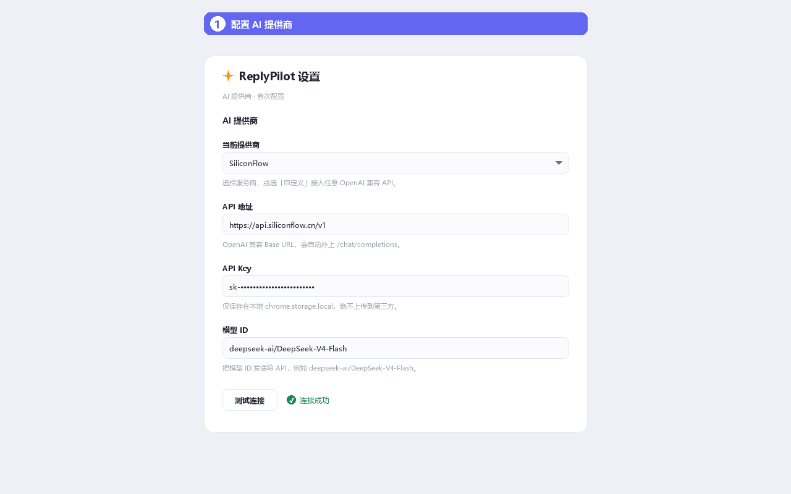
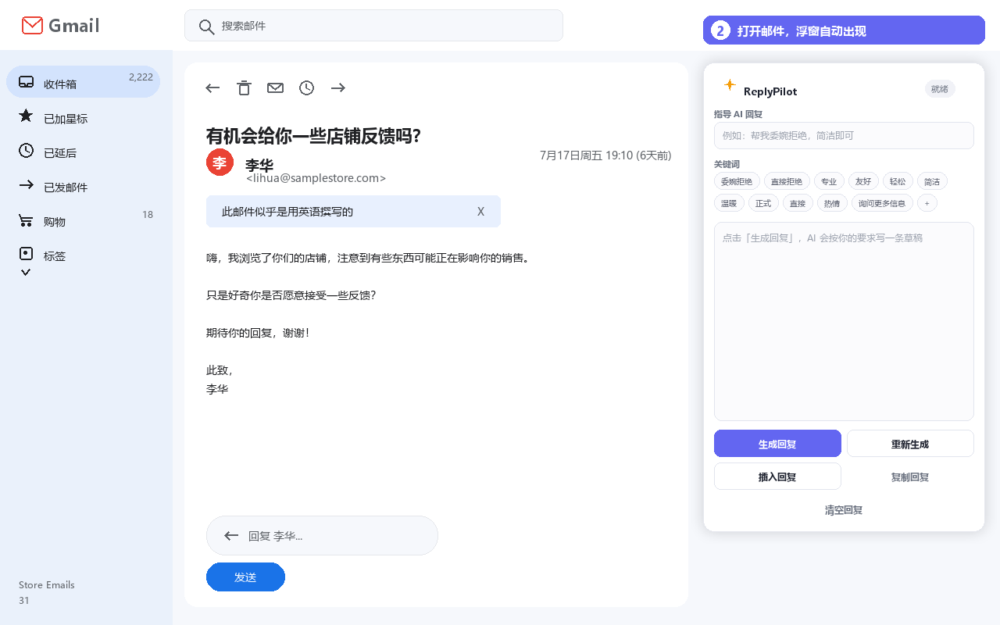
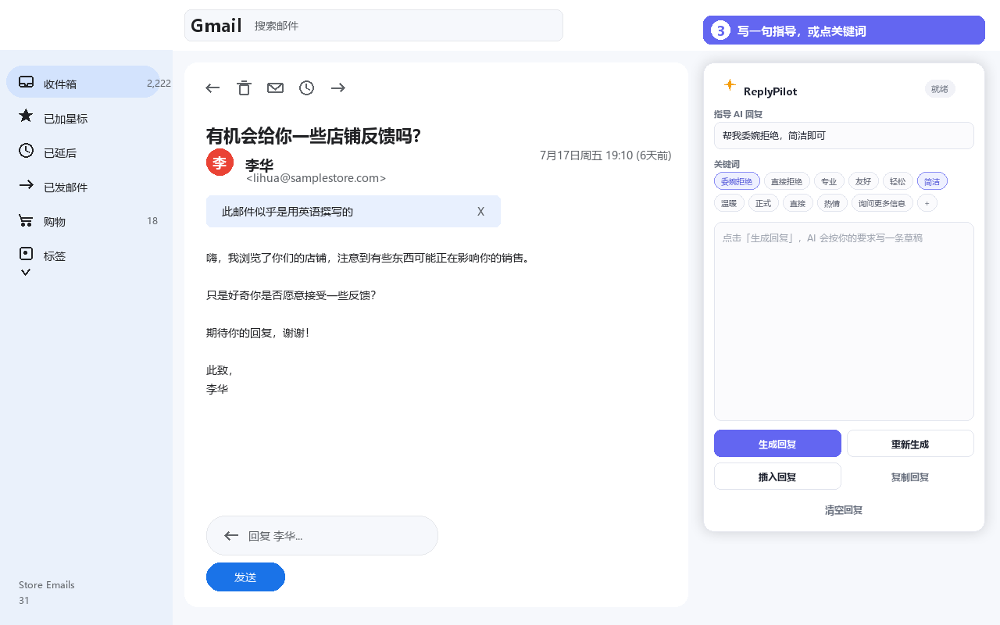
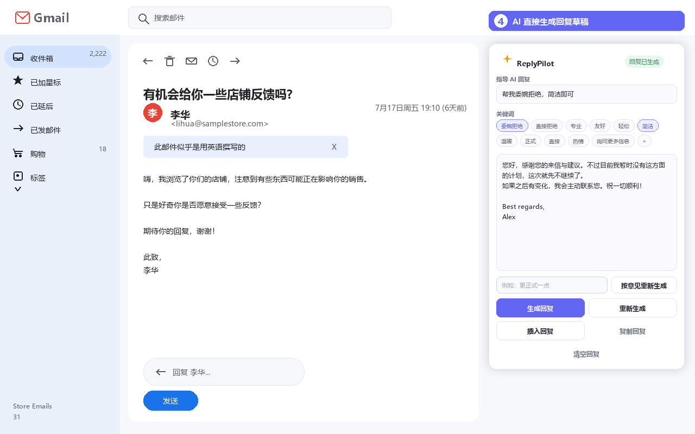
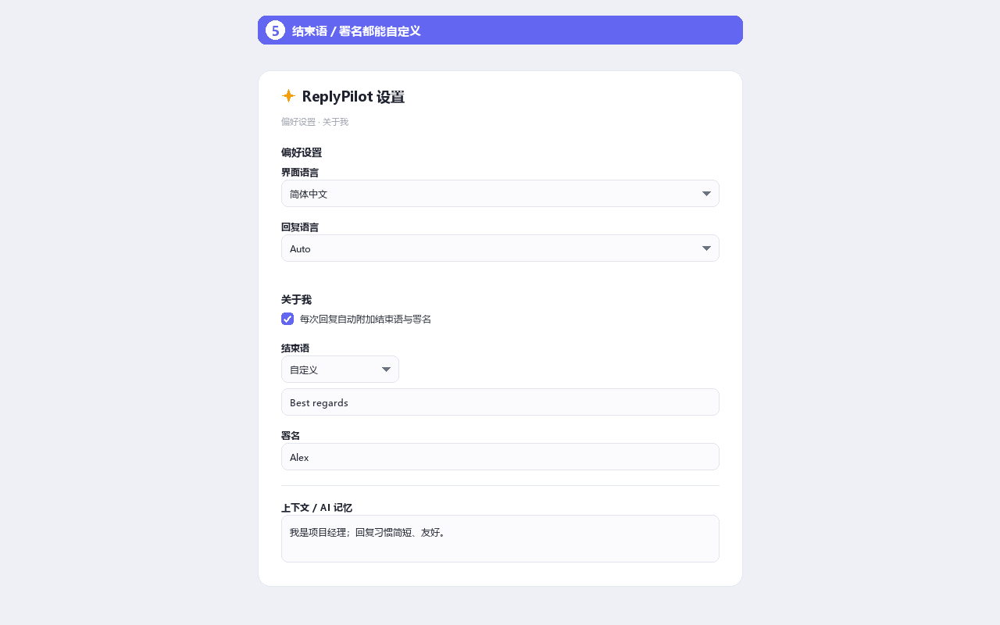

<div align="center">
  
  <h1>ReplyPilot for Gmail</h1>
  <p><strong>Gmail 中的 AI 邮件回复助手 · AI-Powered Gmail Reply Assistant</strong></p>
  <p>读取当前邮件上下文，生成可直接使用的回复草稿</p>

  <p>
    <a href="https://chromewebstore.google.com/detail/replypilot-for-gmail/aeeapbjpefjokopgbklkalmonchijdfk">
      
    </a>
    <a href="LICENSE">
      
    </a>
    
  </p>
</div>

---

## 📖 简介 · Overview

**ReplyPilot** 是一个 Manifest V3 Chrome 扩展，面向 **Gmail Web**。它读取当前打开的邮件内容，可在浮窗中输入回复要求（如「委婉拒绝，简洁即可」）或点击关键词快捷填入，由 AI 模型（支持 SiliconFlow / OpenAI / 自定义端点）生成回复草稿，插入 Gmail 回复框或复制到剪贴板。

> 适用场景：工作往来、客户沟通、合作洽谈与个人邮件等需要快速、得体回复的场合。

---

## ✨ 核心功能 · Features

| 功能 | 说明 |
|------|------|
| 🤖 **AI 生成回复** | 输入回复要求或选择关键词后，生成回复草稿 |
| 🔌 **多 AI 提供商** | 支持 SiliconFlow、OpenAI 及任意 OpenAI 兼容 API 端点 |
| 💬 **自然语言指导** | 用一句话说明要求，如「帮我委婉拒绝，简洁即可」 |
| 🏷️ **关键词快捷填入** | 内置语气/意图关键词（专业、友好、简洁、委婉拒绝、询问更多信息…），点击即可填入指导框，可自定义增删 |
| 🌐 **多语言回复** | 自动检测或手动指定回复语言（中文/英文/自动） |
| ✍️ **结束语与署名** | 结束语（如「Best regards」）与署名分开设置；结束语可自定义，也可由 AI 根据语境生成 |
| 🧠 **AI 记忆** | 可填写身份、背景与风格，AI 自动参考，回复更贴合你的语气 |
| 📝 **插入回复框** | 生成的回复直接插入 Gmail 回复框，无需复制粘贴 |
| 📋 **复制到剪贴板** | 也可复制后手动粘贴 |
| 🔄 **重新生成** | 对结果不满意时可重新生成 |
| 🗣️ **双语界面** | 支持中文（简体）和英文界面，运行时即时切换 |
| 🔒 **隐私安全** | API Key 仅存储在本地，绝不记录到日志 |
| 🖱️ **可拖动卡片** | 浮动卡片可拖动位置，避免遮挡邮件内容 |
| 📦 **免配置接入** | 完成一次 API 配置后，打开 Gmail 邮件点击回复即自动显示 |

---

## 📸 预览 · Screenshots

<table>
  <tr>
    <td align="center"><strong>① 配置 AI 提供商</strong></td>
    <td align="center"><strong>② 打开邮件，浮窗出现</strong></td>
  </tr>
  <tr>
    <td></td>
    <td></td>
  </tr>
  <tr>
    <td align="center"><strong>③ 写指导 / 点关键词</strong></td>
    <td align="center"><strong>④ AI 生成回复草稿</strong></td>
  </tr>
  <tr>
    <td></td>
    <td></td>
  </tr>
  <tr>
    <td align="center" colspan="2"><strong>⑤ 结束语 / 署名 / AI 记忆可自定义</strong></td>
  </tr>
  <tr>
    <td align="center" colspan="2"></td>
  </tr>
</table>

---

## 🚀 安装 · Installation

### Chrome Web Store（推荐）

[](https://chromewebstore.google.com/detail/replypilot-for-gmail/aeeapbjpefjokopgbklkalmonchijdfk)

点击上方徽章或访问 Chrome Web Store 直接安装。

### 开发者模式（本地加载）

1. 打开 Chrome，访问 `chrome://extensions`
2. 开启右上角 **开发者模式（Developer mode）**
3. 点击 **加载已解压的扩展程序（Load unpacked）**
4. 选择本项目所在文件夹
5. 扩展图标出现在工具栏中

---

## ⚙️ 快速配置 · Quick Setup

1. **获取 API Key**
   - [SiliconFlow](https://siliconflow.cn)：注册后进入控制台 → API 密钥 → 创建密钥
   - [OpenAI](https://platform.openai.com)：获取 API Key

2. **打开设置**
   - 点击工具栏 `ReplyPilot` 图标 → **Open Settings**
   - 或右键扩展图标 → **选项（Options）**

3. **填写配置**
   - **AI Provider**：选择 SiliconFlow / OpenAI / Custom
   - **API Base URL**：根据提供商自动填充（如 https://api.siliconflow.cn/v1），Custom 模式可填入任意 OpenAI 兼容端点
   - **API Key**：输入你的密钥（安全存储在 `chrome.storage.local`）
   - **Model ID**：如 `deepseek-ai/DeepSeek-V4-Flash`、`gpt-5-mini` 等
   - **界面语言**：中文 / English
   - **回复语言**：Auto / 中文 / English
   - **关键词与语气**：在 Gmail 浮窗里选择/输入（不在此页）

4. **完善「关于我」（可选）**
   - **结束语**：填写正文后的敬语（如「Best regards」），或勾选「由 AI 根据语境生成」
   - **署名**：填写你的名字；并选择是否每次回复自动附加「结束语 + 署名」
   - **上下文 / AI 记忆**：填写身份、与收件人的关系、回复偏好等，AI 会自动参考

5. **点击保存**

---

## 🎯 使用指南 · How to Use

1. 打开 [Gmail](https://mail.google.com) 并打开任意一封邮件
2. 点击 **回复（Reply）** → `✨ ReplyPilot` 浮动卡片自动出现在回复框上方
3. 在**指导框**输入回复要求（如「帮我委婉拒绝，简洁即可」），或点击**关键词**（内置语气与常用说法）填入
4. 点击 **Generate Reply** → AI 依据指导生成一条回复草稿
5. 可在文本框内编辑微调
6. 点击 **Insert Reply** → 文本自动插入 Gmail 回复框
7. 或点击 **Copy Reply** → 复制到剪贴板，自行粘贴发送

> 切换邮件不会创建重复卡片（每个回复框有去重标记）。

---

## 🧩 支持的工作模式

### 内置关键词（默认）

| 关键词 | 说明 |
|------|------|
| 📋 **Professional** | 正式、专业、商务 |
| 😊 **Friendly** | 友好、亲切、轻松 |
| 💬 **Casual** | 轻松、随意、口语化 |
| 📝 **Short** | 简洁、直接、要点明确 |
| 🤗 **Warm** | 温暖、共情、有人情味 |
| 🏛️ **Formal** | 正式、严谨、庄重 |
| 🎯 **Direct** | 直接、果断、明确立场 |
| 🔥 **Enthusiastic** | 热情、积极、有感染力 |
| 🙅 **Decline (polite)** | 委婉拒绝、礼貌、留有余地 |
| ⛔ **Decline (direct)** | 明确、直接地拒绝 |
| ❓ **Ask more** | 询问更多信息 |
| ⏭️ **Follow up** | 稍后跟进 |

> 以上关键词均可点击填入指导框，也可在浮窗中自定义增删。

### AI 提供商

| 提供商 | API 端点 | 默认模型 | 特点 |
|--------|----------|----------|------|
| **SiliconFlow** | `api.siliconflow.cn` | `deepseek-ai/DeepSeek-V4-Flash` | 国内可用，性价比高 |
| **OpenAI** | `api.openai.com` | `gpt-5-mini` | 全球知名 |
| **Custom** | 用户自定义 | 用户自定义 | 兼容任何 OpenAI 兼容 API |

---

## 🌐 多语言支持 · i18n

- 支持 **中文（简体）** 和 **English** 两种界面语言
- 语言可在设置页面运行时即时切换，无需重启扩展
- 回复语言可独立设置：Auto / 中文 / English
- 语言选择优先级：URL 参数 `?lang=` > 存储设置 > 浏览器语言

---

## 🔒 隐私与安全 · Privacy & Security

- **API Key** 仅存储在 `chrome.storage.local`，不写入日志，也不随其他数据上传
- 邮件内容**仅发送**到用户选择的 AI 提供商（您配置的 API 端点）
- **不会**自动发送邮件，所有发送需用户手动确认
- 日志模块对密钥做脱敏处理，不会记录密钥内容
- 扩展**不收集**任何用户数据
- 远程代码：仅用 `fetch()` 调用用户配置的 AI API，**不使用** `eval` 或其他远程代码执行

> 完整隐私政策：[ReplyPilot Privacy Policy](https://vaxicy.github.io/ReplyPilot/privacy-policy.html)

---

## 🏗️ 技术架构 · Architecture

```
ReplyPilot/
├── manifest.json                  # MV3 清单文件
├── background/
│   └── service-worker.js          # 后台 Service Worker
├── content/
│   ├── gmail-content.js           # 内容脚本入口：MutationObserver + 注入编排
│   ├── gmail-dom.js               # Gmail DOM 读取 + 回复插入
│   ├── reply-ui.js                # 构建并管理注入的 ReplyPilot 浮动卡片
│   └── content.css                # 注入卡片的样式
├── popup/                         # 工具栏弹窗
├── options/                       # 设置页面
├── services/
│   ├── ai-service.js              # AI 服务编排
│   └── siliconflow.js             # SiliconFlow/OpenAI 兼容客户端
├── utils/
│   ├── storage.js                 # chrome.storage.local 封装
│   ├── parser.js                  # 语言检测 + 提示词构建
│   ├── i18n.js                    # 运行时国际化
│   └── logger.js                  # 安全日志器
├── _locales/                      # 国际化字符串（中/英）
├── icons/                         # 扩展图标
├── store-assets/                  # Chrome Web Store 素材
├── release/                       # 打包产物（历史版本 zip）
└── scripts/                       # 素材生成 + 打包脚本（package.py）
```

### 技术亮点

- **Manifest V3**：Chrome 当前扩展规范
- **单一全局命名空间 `window.RP`**：多文件内容脚本间通信
- **容错选择器系统**：20+ 种备选选择器适应 Gmail 频繁的标记变化
- **结构回退检测**：选择器均失败时自动检测回复框位置
- **健壮 JSON 解析**：自动处理 AI 返回的各种格式变体

---

## 📦 打包 · Packaging

```bash
python3 scripts/package.py
```

- **版本号取自 `manifest.json`**（唯一真源），产出 `release/ReplyPilot-<version>.zip`（历史版本统一放在 `release/`）。
- zip 内 `manifest.json` 位于**根层级**（不是套一层文件夹），只包含扩展本体：
  `manifest.json`、`_locales/`、`background/`、`content/`、`icons/`、`options/`、
  `popup/`、`services/`、`utils/`、`LICENSE`、`README.md`、`微信赞赏码.png`。
- **不打包**：`store-assets/`（商店截图与 promo 单独上传）、`scripts/`、
  `docs/`（隐私政策走 GitHub Pages）、`.git` / `.codebuddy` 等开发文件。
- 脚本自带校验：`manifest_version == 3`、版本一致、manifest 引用的文件都存在、
  `manifest.json` 位于 zip 根层级、包内 manifest 可重新解析、HTML 里的 `../` 引用可解析。
- 完成后自动复制一份到默认输出目录（工作区根目录，路径由项目位置推导，不硬编码）。

---

## 📋 已知限制 · Known Limitations

- 仅支持 **Gmail Web**（`https://mail.google.com/*`）
- Gmail 标记变更可能导致选择器失效，需更新 `GMAIL_SELECTORS`
- 用户需**手动**点击生成/插入（不自动发送）
- 暂不支持 Outlook、Yahoo、网易邮箱等

---

## 🤝 贡献 · Contributing

欢迎提交 Issue 或 Pull Request 改进本项目。请确保：

1. Fork 本仓库
2. 创建特性分支：`git checkout -b feature/your-feature`
3. 提交改动：`git commit -m 'Add your feature'`
4. 推送到分支：`git push origin feature/your-feature`
5. 提交 Pull Request

---

## 📄 许可证 · License

本项目采用 **非商业使用许可证（Non-Commercial License）**。

- ✅ 个人学习、非营利组织、教育机构可免费使用
- ✅ 可修改代码并分发，但衍生作品必须采用相同许可证
- ❌ **禁止任何商业用途**（如需商业授权，请联系作者）

查看 [LICENSE](LICENSE) 文件获取完整条款。

---

<div align="center">
  <p>
    <a href="https://chromewebstore.google.com/detail/replypilot-for-gmail/aeeapbjpefjokopgbklkalmonchijdfk">
      
    </a>
  </p>
  <p>Made with ❤️ for better email</p>
</div>
